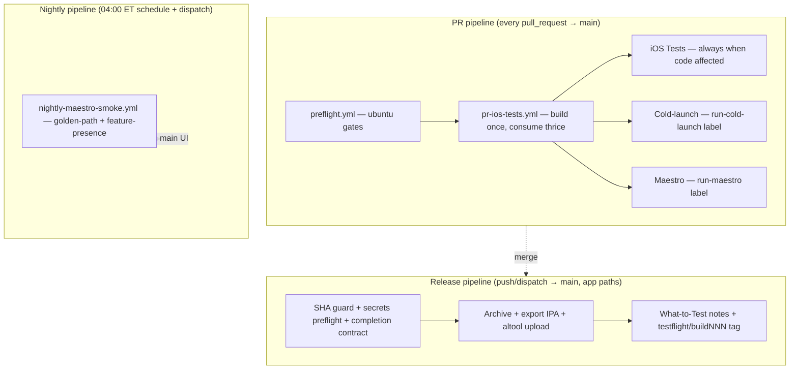

# iOS CI/CD Pipeline Runbook

Unified reference for the AmakaFlow iOS GitHub Actions pipelines (AMA-2280 design, CI-5 runbook).

**Related docs**

- [TESTFLIGHT_SECRETS.md](./TESTFLIGHT_SECRETS.md) — signing rotation, ASC API keys, `.p12` secrets
- [STAGING_TESTFLIGHT_RELEASE.md](./STAGING_TESTFLIGHT_RELEASE.md) — founder/device validation checklist

---

## Architecture

Three independent pipelines share no macOS build artifacts between them:



**Supporting workflows** (not part of the three pipelines above):

| Workflow | Role |
|----------|------|
| `conflict-detection.yml` | Comments on open PRs with merge conflicts |
| `claude-auto-merge.yml` | Factory Droid auto-merge helper |
| `claude-fix-reviews.yml` | Auto-fix on Droid review comments |

**Target workflow count:** 7 files under `.github/workflows/` (design doc §1).

| File | Pipeline |
|------|----------|
| `pr-ios-tests.yml` | PR |
| `preflight.yml` | PR |
| `ios-testflight.yml` | Release |
| `nightly-maestro-smoke.yml` | Nightly |
| `conflict-detection.yml` | Support |
| `claude-auto-merge.yml` | Support |
| `claude-fix-reviews.yml` | Support |

**Removed (CI-5 kill list):** `ios-tests.yml`, `agent-validation.yml`, `pr-ios-tests-docs-skip.yml` (CI-3).

---

## Branch protection — 7 required checks

These job names must stay stable (CI-3); renaming breaks branch protection.

| # | Check name | Workflow | Docs-only PR |
|---|------------|----------|--------------|
| 1 | SwiftLint | `pr-ios-tests.yml` | runs |
| 2 | Detect Changed Files | `pr-ios-tests.yml` | runs |
| 3 | Build Debug-sim .app | `pr-ios-tests.yml` | **skipped** |
| 4 | iOS Tests (PR - Impacted) | `pr-ios-tests.yml` | **skipped** |
| 5 | Cold-launch on … | `pr-ios-tests.yml` | **skipped** (opt-in label) |
| 6 | Maestro Flow Tests | `pr-ios-tests.yml` | **skipped** (opt-in label) |
| 7 | Resolve every host in Environment.swift | `preflight.yml` | runs |

Additional preflight jobs (`Lint Info.plist…`, `No .shared singletons…`) run on code-affecting PRs but are not in the required-seven set.

**Baseline:** docs-only PR wall time ~20–24 s (ubuntu + skipped macOS). Typical code PR macOS wall time ≤10 min (build + impacted tests).

---

## How to cut a TestFlight build

### Automatic (normal path)

Every merge to `main` that touches app paths triggers `ios-testflight.yml`:

- `AmakaFlow/**`
- `AmakaFlowCompanion/**`
- `e2e/maestro/**`
- `.github/workflows/ios-testflight.yml`

Steps: merge PR → [Actions → iOS TestFlight Upload](https://github.com/Amakaflow/amakaflow-ios-app/actions/workflows/ios-testflight.yml) → wait for **Archive + Upload to TestFlight** (~9–12 min to altool complete; What-to-Test + tag add ~1–2 min).

Build number: `100 + github.run_number` (monotonic, no `pbxproj` bump).

### Skip upload

Include `[skip-testflight]` anywhere in the merge commit message. Preflight/contract jobs still run; archive/upload jobs skip.

### Manual dispatch

```bash
gh workflow run ios-testflight.yml --ref main \
  -f expected_sha="$(git fetch origin main && git rev-parse origin/main)"
```

**`expected_sha` guard:** when set, the workflow aborts in seconds if `origin/main` HEAD differs (stale-dispatch protection, AMA-2281).

### Post-upload artifacts

- Git tag: `testflight/buildNNN` on the uploaded commit
- TestFlight **What to Test** notes set via ASC API
- Workflow artifacts: IPA, dSYMs, archive/export/altool logs (14-day retention)

See [STAGING_TESTFLIGHT_RELEASE.md](./STAGING_TESTFLIGHT_RELEASE.md) for founder validation steps.

---

## Optional PR Maestro and cold-launch

Both are **opt-in** on open PRs (never required for merge):

| Label | Job | Timeout cap |
|-------|-----|-------------|
| `run-maestro` | Maestro Flow Tests | 75 min |
| `run-cold-launch` | Cold-launch matrix | 12 min |

Add the label on the PR (or re-run after adding — workflow listens for `labeled` events). Removing labels does not cancel an in-flight run; push a new commit or cancel the run in Actions.

Maestro uses the shared Debug-sim `.app` artifact from the single PR build (no second compile).

---

## Nightly Maestro smoke

| | |
|---|---|
| **Schedule** | 04:00 ET daily (`0 9 * * *` UTC) |
| **Workflow** | `nightly-maestro-smoke.yml` |
| **Scope** | Golden-path + feature-presence against latest `main` |
| **Paging** | **Disabled** — failures appear in Actions only |

### Manual dispatch

Actions → **Nightly Maestro Smoke** → **Run workflow** → branch `main` → Run.

### Green-night scoreboard

**Current: 0/10** consecutive green scheduled nights (as of 2026-07-07).

First scheduled run `28863293299` failed (golden-path + feature-presence timeout). Paging (Telegram / Linear P1 / GitHub issue) stays off until **10/10** green nights, then only by explicit founder decision (AMA-2280).

---

## Signing rotation

Do **not** mint new "Created via API" certs on CI runners. CI imports persisted Distribution + Development `.p12` identities from GitHub secrets before archive.

Full procedure: [TESTFLIGHT_SECRETS.md § Persisted signing identities](./TESTFLIGHT_SECRETS.md#persisted-signing-identities-ama-2267).

Quick checks:

1. [Apple Certificates list](https://developer.apple.com/account/resources/certificates/list) — revoke stale "Created via API" certs before creating new ones
2. Run **two consecutive** green `workflow_dispatch` builds — confirm zero new portal certs
3. On cert-slot errors, workflow logs link to this doc

---

## Reading failures

### Where logs and artifacts live

| Pipeline | Primary log | Artifacts |
|----------|-------------|-----------|
| PR | Job summary + step logs in Actions | `test-products`, `cold-launch-app`, Maestro screenshots |
| Release | `archive.log`, `export.log`, `altool.log` in job + uploaded bundle | `testflight-build-NNN` (IPA, dSYMs) |
| Nightly | Maestro stdout in job | `golden-path-smoke` bundle |

### Common failure modes

| Symptom | Likely cause | Fix |
|---------|--------------|-----|
| Dispatch aborts in &lt;10 s | `expected_sha` stale | Re-dispatch with current `origin/main` SHA |
| Missing secrets preflight | ASC / Clerk / signing secret | [TESTFLIGHT_SECRETS.md](./TESTFLIGHT_SECRETS.md) |
| Certificate limit | Too many API-created certs | Revoke unused certs, re-run |
| IPA Clerk mismatch | xcodebuild arg drop | Check **Inspect IPA Info.plist** step |
| Completion contract fail | iOS fixture drift vs staging OpenAPI | Fix fixtures or mapper-api schema |
| PR macOS timeout | Slow cache miss or large diff | Re-run; check impacted-tests scope |

### SHA guard (stale dispatch)

When `expected_sha` is provided on `workflow_dispatch`, job **Dispatch SHA guard** fetches `main` and compares HEAD. Mismatch → fast fail with message to refresh SHA. Push-triggered runs skip this job.

---

## Paging policy

| Event | Pages? | Mechanism |
|-------|--------|-----------|
| PR check failure | No | PR status only |
| Nightly smoke failure | **No** (0/10 scoreboard) | Actions tab only |
| TestFlight upload failure on `main` | Design-approved only | Not wired in CI-5; ops monitors Actions |
| Maestro on release path | **Never** | Removed in CI-4 (no post-upload Maestro) |

Do **not** re-add post-upload Maestro to `ios-testflight.yml` or enable nightly paging before 10/10 green nights.

---

## Sentry symbols and releases

| Path | Status |
|------|--------|
| Xcode **Upload Debug Symbols to Sentry** build phase | Runs at archive when `sentry-cli` + `SENTRY_AUTH_TOKEN` present |
| TestFlight workflow artifacts | dSYMs uploaded to Actions (`testflight-build-NNN`) |
| ~~`ios-tests.yml` `sentry-release` job~~ | **Removed CI-5** — Sentry release registration (AMA-1082) deferred |

Re-wiring Sentry release registration to the release pipeline is a follow-up ticket (founder approval). Crash symbolication from TestFlight/App Store Connect dSYM upload (`uploadSymbols: true` in export) remains active.

---

## Guardrails (CI-5 audit)

| Guardrail | PR | Release | Nightly |
|-----------|----|---------|---------|
| macOS job `timeout-minutes` | ✓ (build 18, tests 28, maestro 75, cold-launch 12) | ✓ (archive 90) | ✓ (job 25) |
| `concurrency` + `cancel-in-progress` | ✓ `ios-pr-*`, `preflight-*` | ✓ `testflight-*` | ✓ `nightly-smoke` |
| No paging steps | ✓ | ✓ | ✓ (explicitly disabled) |
| No post-upload Maestro | n/a | ✓ | n/a |

---

## Stability targets (CI-0)

Measured from first merge **after** CI-3 landed (`2026-07-06`), over **7 days** with **≥5 merges** to `main`:

| Metric | Target |
|--------|--------|
| PR required checks (typical change) | ≤10 min macOS wall |
| Merge → TestFlight altool complete | ≤12 min |
| Flake pages (Telegram / Linear P1 / GH issue from workflows) | 0 |
| Cert churn (new API-created certs) | 0 |

Partial baseline (pre–7-day window) lives on AMA-2282 / AMA-2278 Linear comments until the clock completes.

---

## Swift 6 warnings (AMA-2275)

Out of scope for CI-5. Re-triage at CI-0 close: schedule post–Mobile Beta or archive as accepted warnings documented here.

<!-- CI-5 post-merge validation 2026-07-07 -->
